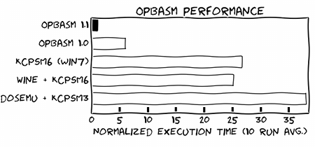
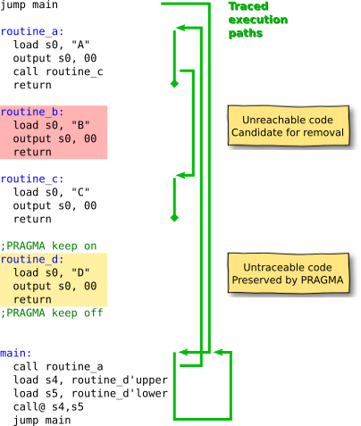
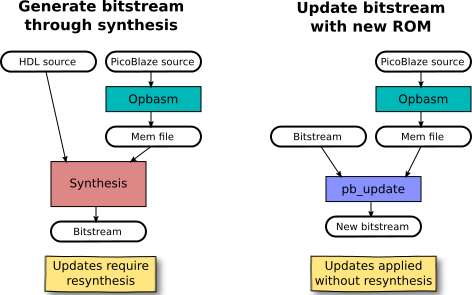

.. Opbasm documentation master file, created by
   sphinx-quickstart on Thu May 21 16:31:36 2015.
   You can adapt this file completely to your liking, but it should at least
   contain the root `toctree` directive.

========================
Open PicoBlaze Assembler
========================

Opbasm is a free cross-platform assembler for the PicoBlaze-3 (PB3) and PicoBlaze-6 (PB6) microcontrollers `provided by Xilinx <http://www.xilinx.com/products/intellectual-property/picoblaze.html>`_. It will run readily on any platform with a Python interpreter. Opbasm provides a better performing solution to assembling PicoBlaze code without resorting to DOS or Windows emulation to run the native KCPSM assemblers.

.. raw:: html

  <tty-player autoplay loop controls src="_static/tty/demo.ttyrec"></tty-player>

**Special features of Opbasm:**

 * Optional :doc:`m4 preprocessor macros <rst/m4>` are available when the m4 program is installed. An extensive set of built-in macros provide more advanced features than the base language. For example, converting temperature scales becomes as easy as this:

  .. code-block:: picoblaze

    reg16(rx, s4,s5)                ; Create a virtual 16-bit register pair named rx

    c_to_f:
      load reglower(rx), s0         ; Load 8-bit Celsius temperature into low byte
      signex(rx)                    ; Sign extend to 16-bits
      expr2s(rx := rx * 9 / 5 + 32) ; Perform 16x8-bit signed arithmetic to get Fahrenheit
      return

 * Includes an optimizer that performs `static code analysis`_ to identify dead code and optionally remove it. This permits the development of code libraries that can be included without wasting memory on unused functions.

 * Code block annotations with `user defined PRAGMA meta-comments`_.
 
 * A basic :doc:`command line simulator Opbsim <rst/opbsim>` is included.

Support for the full PicoBlaze-6 syntax is provided as well as `enabling most of the new PB6 syntax enhancements in PicoBlaze-3 code`_. The original templating system for ROM components is supported as well as a more flexible `generic ROM component`_ that can read *.mem* and *.hex* files directly during synthesis and simulation. A utility script is included that permits `updating the ROM contents of a bitstream file`_ without requiring resynthesis as was formerly supplied by the DOS-based KCPSM3 tools.

Files generated on non-Windows platforms will not have DOS line endings and PicoBlaze-3 files are not restricted to 8.3 file names. Opbasm also runs significantly faster than the native implementation:

Learning about PicoBlaze
------------------------

If you are unfamiliar with the PicoBlaze architecture you can review the :doc:`reference guide <rst/language>` that describes its inner workings. The official documentation for KCPSM6 is also useful as Opbasm supports its syntax completely with a few extensions. If you are unfamiliar with assembly language programming in general there is a :doc:`tutorial <rst/tutorial>` that can guide you through the process of writing in assembly and demonstrates the steps needed to develop a working program.

Requirements
------------

Opbasm requires Python 3.x and no additional libraries. The installation script depends on setuptools which will be installed if it isn't currently present in your Python distribution. Optional macro support is provided when m4 is installed. You can get optional colorized output from the scripts by installing the Python colorama package.

Download
--------

You can access the Opbasm Git repository from `Github <https://github.com/kevinpt/opbasm>`_. You can install direct from PyPI with the ``pip`` command if you have it available.

Installation
------------

You must have Python installed first. Most modern Linux distributions and OS/X have it available by default. There are a number of options available for Windows. If you don't already have a favorite, I recommend getting one of the `"full-stack" Python distros <http://www.scipy.org/install.html>`_ that are geared toward scientific computing such as Anaconda or Python(x,y).

If your OS has a package manager, it may be preferable to install Python setuptools through that tool before attempting to install Opbasm. Otherwise, the installation script will install these packages directly without registering them with the OS package manager.

The easiest way to install Opbasm is from `PyPI <https://pypi.python.org/pypi/opbasm>`_.

.. code-block:: console

  > pip install --upgrade opbasm

This will download and install the latest release, upgrading if you already have it installed. If you don't have ``pip`` you may have the ``easy_install`` command available which can be used to install ``pip`` on your system:

.. code-block:: console

  > easy_install pip
  
You can also use ``pip`` to get the latest development code from Github:

.. code-block:: console

  > pip install --upgrade https://github.com/kevinpt/opbasm/tarball/master

If you manually downloaded a source package or created a clone with Git you can install Opbasm with the following command run from the base Opbasm directory:

.. code-block:: console

  > python setup.py install

On Linux systems you may need to install with root privileges using the *sudo* command.

After a successful install the Opbasm scripts will be available. On Linux they should be immediately accessible from your current search path. On Windows you will need to make sure that the ``<Python root>\Scripts`` directory is in your %PATH% environment variable.

If you can't use the installer script, it is possible to run *opbasm.py* directly without installation.

.. code-block:: console

  > python opbasm.py ...

The m4 preprocessor is optional. It is usually already installed on Linux. The m4 documentation provides :ref:`guidance on installing m4 under Windows <guidance on installing m4 under Windows>`.

.. _enabling most of the new PB6 syntax enhancements in PicoBlaze-3 code:

PicoBlaze-3 enhancements
------------------------

You can use all PicoBlaze-6 syntax extensions in PicoBlaze-3 code that don't depend on PB6 specific instructions. This makes writing PB3 code much less painful.

For PicoBlaze-3 you can use the following syntax extensions from PicoBlaze-6:

  * Decimal, binary, and character literals (``41'd, 01000001'b, "A"``)
  * Predefined char constants and date/time stamp fields (``CR, LF, HT, datestamp_day``, etc.)
  * Inverted constants ( ``~my_const`` )
  * Environment variable constants ( ``constant foo, %my_env_const`` )
  * :ref:`INCLUDE <inst-include>`, :ref:`DEFAULT_JUMP <inst-default_jump>`, and :ref:`INST <inst-inst>` directives
  * Address label constants ( ``my_label'upper  my_label'lower`` )

For PicoBlaze-3 you *CANNOT* use the following:

  * :ref:`STRING <inst-string>` and :ref:`TABLE <inst-table>` directives
  * :ref:`PicoBlaze-6 instructions <inst-pb6>` (``CALL@, COMPARECY, HWBUILD, JUMP@, LOAD&RETURN, OUTPUTK, REGBANK, STAR, TESTCY``)

Note that the included m4 macros have :ref:`alternative string operations <string and table ops>` that do work on PicoBlaze-3 as well as a :ref:`portable string system <Portable string and table operations>` that is optimized for both target processors.

Refer to the file "all_kcpsm6_syntax.psm" distributed with KCPSM6 for a detailed
explanation of the new PicoBlaze-6 syntax.

PicoBlaze-6 enhancements
------------------------

The native PB6 assembler KCPSM6.exe has a -c switch to limit the size of memory. Opbasm provides -m to do the same as well as -s to limit the scratchpad memory size to 64 or 128 bytes. MEM format files are output by default. KCPSM6-style HEX format is activated with *-x*.

The predefined string "Opbasm_version$" is available to record the assembler version starting from version 1.3.3. This is a substitute for "KCPSM6_version$" which is not predefined by Opbasm.

Syntax extensions
-----------------

Two non-standard syntax extensions have been implemented in Opbasm. The first is the ability to define local labels by prefixing them with a ".". Local labels do not have to be globally unique, making it easier to construct commonly used names inside procedures without concern for collisions or excessively long names. Internally, local labels are implemented by appending them to the immediately preceeding global label. The fully expanded name can be referred to anywhere in the program. The bare local label can be referred anywhere between the nearest global labels bounding it.

.. code-block:: picoblaze

  my_proc:
    load s0, 04
  .loop:            ; Local label for this procedure
    add s1, s0
    sub s0, 01
    compare s0, 00
    jump nz, .loop  ; Jump to local loop label
    return
    
  my_proc2:
    <something else>
  .loop:            ; This is a different loop label
    <something else>
    return
    
  jump my_proc.loop ; Access the local label by referring to its expanded name
  
Labels generated by macro expansions are all prefixed with "__". This prefix is ignored when tracking global labels so that structured programming macros can be invoked without any unexpected changes in the behavior of local labels.
  
Another small extension to the syntax is that the :ref:`inst-address` directive can take a label as a parameter as well as a numeric address. This is most useful when defining an ISR by inserting a :ref:`inst-jump` instruction at the vector address and then returning back to a labeled address to resume assembling code from the the next point in memory.

.. code-block:: picoblaze

  my_isr:
    address 3FF     ; Switch to interrupt vector address
    jump my_isr     ; Assemble instruction at interrupt vector location
    address my_isr  ; Resume assembly at address previously captured in "my_isr"
    <ISR code>
    returni

m4 preprocessor
---------------

Opbasm uses the m4 preprocessor to provide enhanced syntax to PicoBlaze developers. A useful package of predefined macros is included automatically when m4 is run. You can activate m4 by naming source files with the ".psm4", or ".m4" extensions or by passing the *--m4* option. See the more detailed :doc:`m4 documentation <rst/m4>` for more information on using the preprocessor macros.

Static code analysis
--------------------

Opbasm provides static code analysis to identify unreachable "dead" instructions and potentially remove them to eliminate wasted memory. There are three command line options *-d* (*--report-dead-code*), *-r* (*--remove-dead-code*), and *-e* (*--entry-point*) used to control static code analysis.

The *-d* (*--report-dead-code*) option activates static code analysis and shows dead instructions in the log file with "DEAD" after the assembled instruction. Instructions identified as dead will be reported and also removed when *-r* (*--remove-dead-code*) is used. Removed instructions appear in the log as comments starting with ";REMOVED:".

Static analysis is performed by following all possible execution paths from a set of initial entry points. There are three possible entry points for PicoBlaze code: address 0, the :ref:`inst-default_jump` target (if used), and the ISR. The *-e* (*--entry-point*) option provides the address of the ISR entry point. It should be a decimal integer or a hex value in 0xnnn format. The ISR entry point defaults to 0x3FF. You will see a summary of the entry point addresses and the number of dead instructions found reported to standard output.

The static analysis can't follow the computed destination of :ref:`call@ <inst-call-at>` and :ref:`jump@ <inst-jump-at>` instructions. A *";PRAGMA keep"* meta-comment can be used to prevent removal of code they jump to. Surround blocks of code with *";PRAGMA keep on"* and *";PRAGMA keep off"* to preserve them. These meta-comments are case insensitive. The log file will show kept instructions with "KEEP" after the assembled instruction.

  
  *Static analysis example*

As an aid to the user, the static analyzer will automatically keep any code that is called or jumped to from a user annotated "keep" block. These blocks are identified with the name "keep_auto" in the log file. In addition, "keep_auto" is automatically applied to blocks of :ref:`load&return <inst-load_return>` instructions that are associated with a label in use. The result is that only unreferenced strings and tables will be marked as dead and potentially removed. "keep_auto" is also automatically applied to any :ref:`inst-inst` directives.

On the first assembly pass it is possible that the amount of extra code present causes spillover beyond the total memory available. When dead code removal is active the bounds checking is suspended on the first pass to allow for the possibility that the code will fit after it is trimmed down. Address bounds checking will still be applied on the final result.

Using Opbasm
------------

After installation you are ready to use Opbasm. The native KCPSM assemblers rely on HDL templates to carry assembled ROM data into synthesis. You can continue to use that process by using the provided Spartan-3 template or using a template from the KCPSM6 distribution. You can alternately use the `picoblaze_rom.vhdl <https://github.com/kevinpt/opbasm/blob/master/templates/picoblaze_rom.vhdl>`_ component which provides a generic resizeable ROM that reads *.mem* and *.hex* files directly without requiring a template. See below for more information on the templating options.

The assembler is invoked with the *opbasm* script. It supports the following command line syntax:

.. parsed-literal::

  Usage: opbasm [-i] <input file> [-n <name>] [-t <template>] [-6|-3] [-m <mem size>] [-s <scratch size>]
                [-d] [-r] [-e <address>]
                [-o <output dir>] [-q] [--m4]
                [--debug-preproc <file>]
         opbasm -g

  Options:
    -h, --help            show this help message and exit
    -i INPUT_FILE, --input=INPUT_FILE
                          Input file
    -n MODULE_NAME, --name=MODULE_NAME
                          Module or entity name (defaults to input file name)
    -t TEMPLATE_FILE, --template=TEMPLATE_FILE
                          Template file
    -6, --pb6             Assemble PicoBlaze-6 code
    -3, --pb3             Assemble PicoBlaze-3 code
    -m MEM_SIZE, --mem-size=MEM_SIZE
                          Program memory size
    -s SCRATCH_SIZE, --scratch-size=SCRATCH_SIZE
                          Scratchpad memory size
    -x, --hex             Write HEX in place of MEM file
    --mif                 Write MIF in place of MEM file
    -o OUTPUT_DIR, --outdir=OUTPUT_DIR
                          Output directory
    -d, --report-dead-code
                          Perform dead code analysis shown in log file
    -r, --remove-dead-code
                          Remove dead code from assembled source
    -e ADDRESS, --entry-point=ADDRESS
                          Set address of ISR (or other) entry point
    -c, --color-log       Colorize log file
    -g, --get-templates   Get default template files
    -v, --version         Show OPBASM version
    -q, --quiet           Quiet output
    --m4                  Use m4 preprocessor on all source files
    -D NAME[=VALUE], --define=NAME[=VALUE]
                          Define m4 macro NAME as having VALUE or empty
    --debug-preproc=FILE  Transformed source file after initial preprocessing

.. note::

  Opbasm currently defaults to using PicoBlaze-3 as the target processor. **Beginning with version 1.4 the default will change to PicoBlaze-6.** You should apply the optional ``-3`` switch when writing PB3 build scripts to guard against this future change.

To compile to PicoBlaze-3 opcodes, use the following:

.. code-block:: console

  > opbasm foo.psm
  OPBASM - Open PicoBlaze Assembler
  Running in PicoBlaze-3 mode
    Device configuration:
      Memory size: 1024, Scratchpad size: 64

    Reading source: foo.psm

    Assembling code... SUCCESS
      15 instructions out of 1024 (1%)
      Highest occupied address: 00E hex

    Found template:
      ROM_form.vhdl

    Writing output
          mem map: foo.mem
         log file: foo.log
        VHDL file: foo.vhdl

    Formatted source:
      foo.fmt

To compile to PicoBlaze-6, use the following:

.. code-block:: console

  > opbasm -6 foo.psm
  OPBASM - Open PicoBlaze Assembler
  Running in PicoBlaze-6 mode
  ...

By default, Opbasm outputs *.mem* format ROM listings as produced by KCPSM3. If you want to output the *.hex* format listings produced by KCPSM6 pass the *-x* option. The only difference is that *.mem* format includes an "@nnn" address directive setting the starting offset for the memory.

Opbasm returns 0 on success and can be incorporated into automated builds using make or another build/scripting system.

Templating
~~~~~~~~~~

All of the official KCPSM-provided HDL templates are supported. Any custom templates you have created can be used unchanged. Because of improvements to XST's support for synthesis of BRAM generics since the last release of KCPSM3, an updated Spartan-3 template `ROM_form_S3_1K.vhdl <https://github.com/kevinpt/opbasm/blob/master/templates/ROM_form_S3_1K.vhdl>`_ is included that eliminates the warnings from redundant attribute declarations. Templates for PicoBlaze-6 devices can be found in the KCPSM6 distribution.

Because Opbasm is more flexible in the naming of modules, the original template system's assumption that the "{name}" field matches the input source file isn't necessarily valid. A new field "{source file}" is added that clearly indicates the original top level source file used to populate a template. This field is optional and only used in a comment so it is not critical to include it in your templates.

The native KCPSM assemblers are hard-coded to look for a template named *ROM_form.vhd* or *ROM_form.v*. Opbasm searches for templates by those names (as well as *ROM_form.vhdl*) but you can also pass the *-t <template file>* option to specify a different template with any arbitrary name. If your OS supports symbolic links it is recommended to maintain a link from the original template to *ROM_form.xxx* rather than renaming it to one of the generic defaults.

To save the bother of hunting down templates when you start a new project, you can generate copies of the default templates included with Opbasm using the following command:

.. code-block:: console

  > opbasm -g
  Retrieving default templates...
  ROM_form_S3_1K.vhdl,picoblaze_rom.vhdl
    COPYING:  /usr/local/lib/python2.7/dist-packages/opbasm-1.0-py2.7.egg/templates/ROM_form_S3_1K.vhdl
    COPYING:  /usr/local/lib/python2.7/dist-packages/opbasm-1.0-py2.7.egg/templates/picoblaze_rom.vhdl

.. _generic_rom:

Generic ROM component
~~~~~~~~~~~~~~~~~~~~~

As an alternative to the templating system, a generic, synthesizable VHDL ROM is provided in the `picoblaze_rom.vhdl <https://github.com/kevinpt/opbasm/blob/master/templates/picoblaze_rom.vhdl>`_  file. This component uses XSTs limited support for textio during synthesis to read a *.mem* or *.hex* file directly without the use of a template file. It takes advantage of XSTs support for automatically partitioning memories that exceed the maximum size of a BRAM. This provides a simplification of the synthesis flow and you do not need to manually switch to different template files if you change the size of the ROM for PicoBlaze-6 designs. For simulation, this component has the advantage that it doesn't have to be recompiled for every change to the PicoBlaze source code in a design and is portable across Xilinx families. It automatically re-reads the latest *.mem* or *.hex* whenever the simulation is reset. A generic can be set to select the implementation as BRAM or distributed RAM.

.. note::

 XST doesn't infer the most efficient partition for a 4Kx18 ROM on Spartan-6. The "``ROM_form_S6_4K_<date>.vhd``" template distributed with KCPSM6 uses only 4 BRAMs rather than 5 and may be a better option.

A dual-ported ``picoblaze_dp_rom`` component is also included in this package. It provides a second read/write port that can be connected to internal logic to facilitate use of packed ROM data stored with :ref:`inst-inst` directives or to use a portion of the BRAM as general purpose RAM. The :ref:`insttable m4 macros <string and table ops>` are included to simplify the creation of ``inst`` directives containing packed byte data.

It is not necessary to have an HDL template file present if you are using the generic ROM.

User defined PRAGMA meta-comments
---------------------------------

To assist with post processing of assembled output, Opbasm includes a facility to annotate blocks of code using PRAGMA meta-comments. It uses a flexible syntax that provides considerable freedom in how you annotate your code.

.. code-block:: picoblaze

  ** Start a block:
  ;PRAGMA <name> [optional arguments] on|start|begin

  ** End a block:
  ;PRAGMA <name> off|stop|end

All fields are case insensitive. Case is preserved for the arguments. Blocks of different types can overlap. PRAGMAs with the "keep" name are the only ones with special behavior (see `static code analysis`_). All others are just annotations that appear in the log. The optional arguments can be any space separated list of strings. The most likely use case is to annotate functions as follows:

.. code-block:: picoblaze

  ;PRAGMA FUNCTION empty_func BEGIN
  empty_func: return
  ;PRAGMA function END

  ;PRAGMA keep on
  ;PRAGMA function another_func arg2 arg3 start
  another_func:
              output s0, 00
              return
  ;PRAGMA function stop
  ;PRAGMA keep off

  ;PRAGMA function nothing begin
  nothing:
  ;PRAGMA function end

The blocks are listed in a section of the log file like this:

.. parsed-literal::

  List of pragma blocks
  ---------------------
     Name      Addr range   Value                     
     ----      ----------   -----                     
     function  (025 - 025)  empty_func
     keep      (026 - 027)  True
     function  (026 - 027)  another_func arg2 arg3

Blocks containing no instructions are omitted from the log ("nothing" in this case). This eliminates any functions removed by static analysis. You can easily extract function bounds from the log file by matching on lines that start with the name you've selected for your PRAGMA.

One potential use for the flexible formatting is to include a signature with a function block. Using VHDL-style syntax you can do the following:

.. code-block:: picoblaze

  ;PRAGMA function do_something [s0, s1 return s0] begin
  ...

This function signature will then appear in the log where it can be post-processed by another tool to track register usage for inputs and return values.

.. _updating the ROM contents of a bitstream file:

Updating bit files
------------------

The KCPSM3 assembler included a program and batch file that automated the process of updating a PicoBlaze ROM in a bit file without requiring a resynthesis. For PicoBlaze-6 that process has been abandoned in favor of using the JTAG loader.

Because some platforms don't readily support the use of the JTAG loader, the old system of updating bit files has been reimplemented as a utility script ``pb_update``. You will need to have a new *.mem* file along with the top level *.ncd* and *.bit* files for the design. The Xilinx ISE tools ``xdl`` and ``data2mem`` must be accessible from your command line path.

When run, the *pb_update* script will convert the *.ncd* netlist to the textual *.xdl* format and scan it for any block RAM instances. If one BRAM is found it is assumed to be the PicoBlaze ROM. If multiple BRAMs are in the design, a list is provided with their instance names and you are prompted to select which one(s) are part of the PicoBlaze ROM. 

If the ROM is divided amongst multiple BRAMs the interactive selection process lets you describe the layout of the memory array. You select the BRAM instances needed to fill out a row of memory until 18 bits for an instruction word are allocated. If the required memory depth isn't satisfied a new row of memory is started where you continue to add BRAMs. The required depth is derived from the number of words present in the assembled *.mem* file.

Once the layout is described, ``pb_update`` runs the ``data2mem`` program with the contents for each BRAM generated according to the layout. After the first run with the interactive BRAM selection, ``pb_update`` outputs a string describing the layout specification that can be passed with the ``-l "<specification string>"`` option to bypass the interactive mode on future runs.

.. parsed-literal::

  > pb_update -m foobar.mem -n foobar.ncd
  PicoBlaze ROM updater
  Running XDL...
  Release 14.5 - xdl P.58f (lin64)
  Copyright (c) 1995-2012 Xilinx, Inc.  All rights reserved.

  Loading device for application Rf_Device from file '6slx4.nph' in environment
    /usr/local/packages/Xilinx/14.5/ISE_DS/ISE/.
     "foobar" is an NCD, version 3.2, device xc6slx4, package tqg144, speed -3
  Successfully converted design 'foobar.ncd' to 'foobar.xdl'.
  Required memory depth: 4096

  ... <interactive BRAM selection>

  Final memory layout:
      Row 0:     0 - 2047    [9][9]
        rom/kcpsm6_rom_lh     2048x9   17 - 9 
        rom/kcpsm6_rom_ll     2048x9    8 - 0 
      Row 1:  2048 - 4095    [9][9]
        rom/kcpsm6_rom_hh     2048x9   17 - 9 
        rom/kcpsm6_rom_hl     2048x9    8 - 0 

  Layout Spec: "rom/kcpsm6_rom_lh,rom/kcpsm6_rom_ll:rom/kcpsm6_rom_hh,rom/kcpsm6_rom_hl"

  Running data2mem...
    data2mem -bm r0_b17_9.bmm -bd r0_b17_9.mem -bt foobar.bit -o b r0_b17_9.bit

  Running data2mem...
    data2mem -bm r0_b8_0.bmm -bd r0_b8_0.mem -bt r0_b17_9.bit -o b r0_b8_0.bit

  Running data2mem...
    data2mem -bm r1_b17_9.bmm -bd r1_b17_9.mem -bt r0_b8_0.bit -o b r1_b17_9.bit

  Running data2mem...
    data2mem -bm r1_b8_0.bmm -bd r1_b8_0.mem -bt r1_b17_9.bit -o b r1_b8_0.bit
  Generated updated bit file: new_foobar.bit

The updated bit file is created with the prefix "``new_``".

Syntax highlighting
-------------------

PicoBlaze syntax highlighting rules for Gedit and Notepad++ have been included in the "highlight" directory in the source distribution.

 * Gedit install: Copy ``picoblaze.lang`` to "~/.local/share/gtksourceview-3.0/language-specs". Create the directories if they do not exist.
 * Notepad++ install: Select "Language|Define your language...". Click "Import..." and select the ``picoblaze.xml`` file.

.. toctree::
   :maxdepth: 1
   :hidden:

   rst/m4
   rst/language
   rst/tutorial
   rst/opbsim
   rst/library

Licensing
---------

Opbasm and the included VHDL source is licensed for free commercial and non-commercial use under the terms of the MIT license.

Indices and tables
------------------

* :ref:`genindex`
* :ref:`search`
